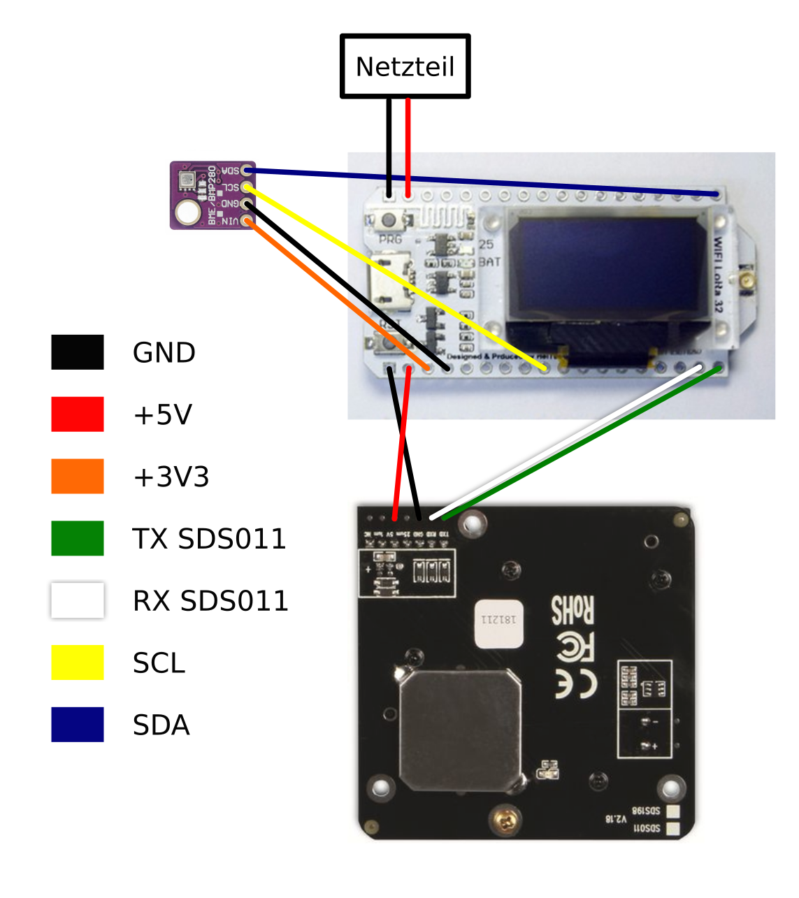

# luftdaten-at-beuth
TTN-based luftdaten.info implementation at Beuth Hochschule Berlin for the PLZN course.

## General information
This project is assembled from Thomas Telkamp and Matthijs Kooijman LMIC ABP example code, the Adafruit BME280 example code,
the modified SDS library from ricki-z ([Link](https://github.com/ricki-z/SDS011/issues/21#issuecomment-479877991)) and code from the iot-basel TTN sensor ([Link](https://github.com/urs8000/particulate-matter_ESP32_SDS011_BME280_DHT22/blob/d78dbddb301234c87b0af3198f2cb772874cb64d/particulate_matter_ESP32-DOIT_SDS011_BME280_DHT22_ABP.ino#L102)).\
__The last code could have been used completely and adapted but I was already mostly done when I found it.__

## Pinout

* 16 -> TX(SDS)
* 17 -> RX(SDS)
* 21 -> SDA
* 22 -> SCL

## Schematic


## Libraries
Add the supplied libraries to your Arduino IDE library folder and install the ESP32 board from the boardmanager and select "Heltec LoRa Wifi 32".

## Hardware
Hardware used in this project:
* Heltec Wifi LoRa 32 v1
* Nova Fitness SDS011
* BME280 I²C
* jumper cables
* 5V 1A power supply (Netzteil in the schematic)

## TTN Decoder
```javascript
function Decoder(bytes, port) { 
  var SDS_ID = (bytes[19] << 24) | (bytes[18] << 16) | (bytes[17] << 8) | bytes[16];
  var SDS_PM10 = (bytes[12] << 8) | bytes[13];
  var SDS_PM25 = (bytes[14] << 8) | bytes[15];
  var temp_x = (bytes[0] <<24) | (bytes[1] << 16) | (bytes[2] <<8) | bytes[3];
  var hum_x = (bytes[8] <<24) | (bytes[9] << 16) | (bytes[10] <<8) | bytes[11];
  var press_bme = (bytes[4] <<24) | (bytes[5] << 16) | (bytes[6] <<8) | bytes[7];

  return{
    
    SDS_ID: SDS_ID,
    PM10: SDS_PM10 / 10,
    PM25: SDS_PM25 / 10,
    Temperature: temp_x / 100,
    Humidity: hum_x / 100,
    Pressure: press_bme
    
  }
}
```

## Helpful links
* https://nathanmcminn.com/2018/09/12/tutorial-heltec-esp32-board-the-things-network/
* https://github.com/iot-basel/ttn-basel-feinstaub/wiki/Home---Anleitung-auf-Deutsch
* https://www.dersuessmann.de/2018/12/feinstaubsensor-f%C3%BCrs-the-things-network-bauen/21
